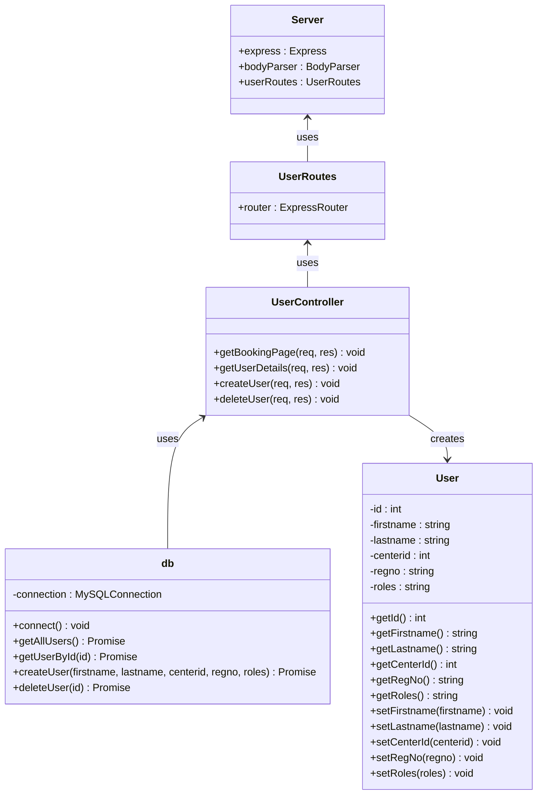
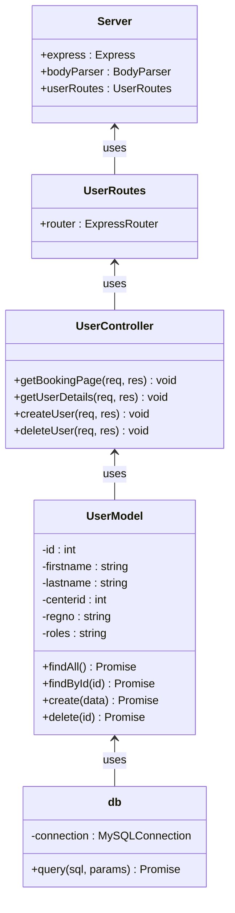

```mermaid

classDiagram
    class db {
        -connection : MySQLConnection
        +connect() void
        +getAllUsers() Promise
        +getUserById(id) Promise
        +createUser(firstname, lastname, centerid, regno, roles) Promise
        +deleteUser(id) Promise
    }

    class User {
        -id : int
        -firstname : string
        -lastname : string
        -centerid : int
        -regno : string
        -roles : string
        +getId() int
        +getFirstname() string
        +getLastname() string
        +getCenterId() int
        +getRegNo() string
        +getRoles() string
        +setFirstname(firstname) void
        +setLastname(lastname) void
        +setCenterId(centerid) void
        +setRegNo(regno) void
        +setRoles(roles) void
    }

    class UserController {
        +getBookingPage(req, res) void
        +getUserDetails(req, res) void
        +createUser(req, res) void
        +deleteUser(req, res) void
    }

    class UserRoutes {
        +router : ExpressRouter
    }

    class Server {
        +express : Express
        +bodyParser : BodyParser
        +userRoutes : UserRoutes
    }

    %% Relationships: ใช้ dependency arrows (<--) สำหรับ "uses"
    UserController <-- db : uses
    UserRoutes <-- UserController : uses
    Server <-- UserRoutes : uses

    %% แสดงความสัมพันธ์ที่ UserController สร้างหรือใช้ User model
    UserController --> User : creates
```

```mermaid
classDiagram
    class db {
        -connection : MySQLConnection
        +query(sql, params) Promise
    }

    class UserModel {
        -id : int
        -firstname : string
        -lastname : string
        -centerid : int
        -regno : string
        -roles : string
        +findAll() Promise
        +findById(id) Promise
        +create(data) Promise
        +delete(id) Promise
    }

    class UserController {
        +getBookingPage(req, res) void
        +getUserDetails(req, res) void
        +createUser(req, res) void
        +deleteUser(req, res) void
    }

    class UserRoutes {
        +router : ExpressRouter
    }

    class Server {
        +express : Express
        +bodyParser : BodyParser
        +userRoutes : UserRoutes
    }

    %% เปลี่ยนให้ UserModel เป็นตัวคุยกับ DB
    UserModel <-- db : uses

    %% Controller คุยกับ Model แทนที่จะคุยกับ DB ตรงๆ
    UserController <-- UserModel : uses

    %% Routes คุยกับ Controller
    UserRoutes <-- UserController : uses

    %% Server คุยกับ Routes
    Server <-- UserRoutes : uses
```