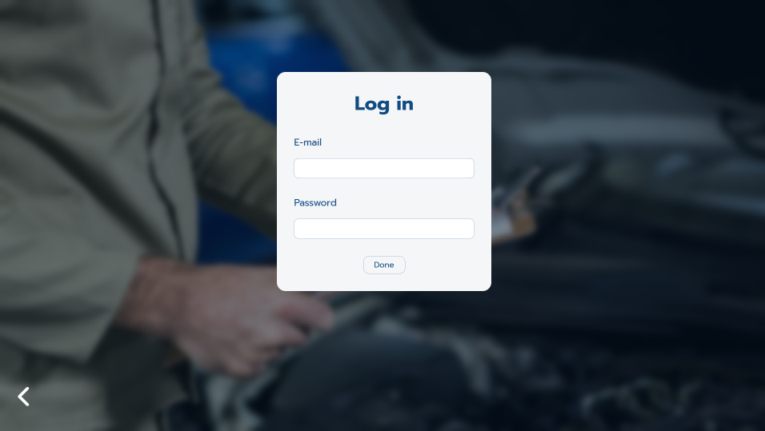
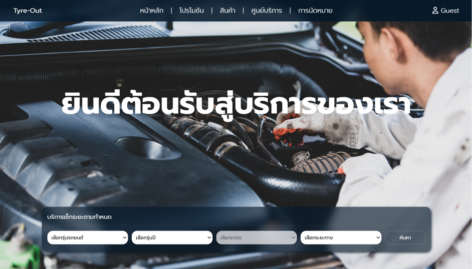
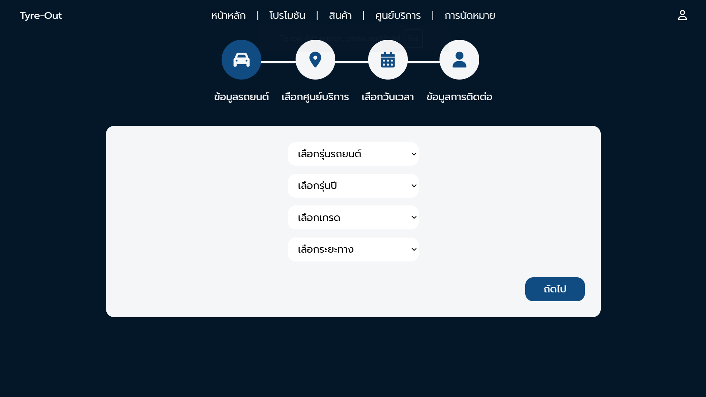
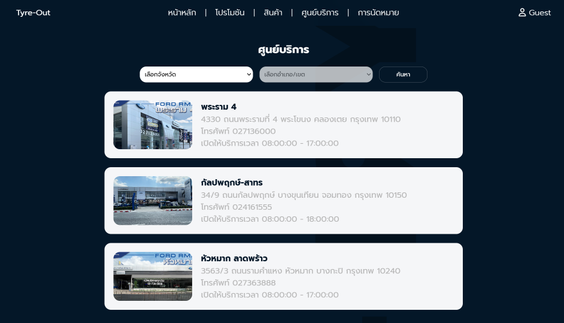

<!-- # Tyre-Out
06066302 Fundamental Web Programming  
School of Information Technology, KMITL  
Year 2/2024

--- -->

# What is Tyre-Out?

### Tyre-Out is a web application designed to be a car service center organizer by using Node.js with Express.js framework.

This project is a part of **Fundamental Web Programming** Course  
School of Information Technology, KMITL  
Year 2/2024

what our web app can do:
- customer can reserve their mileage check by themselves on this web application and see overall goods and services price
- admin can manage their customer such as open ticket, close ticker and others

 
 

# some preview of our project

<!--  -->
### homepage

### booking page

### service center page

 
 

# how to use & install
- [demo with run.bat](./demo.md)
- [runserver by using npm](./npm.md)

