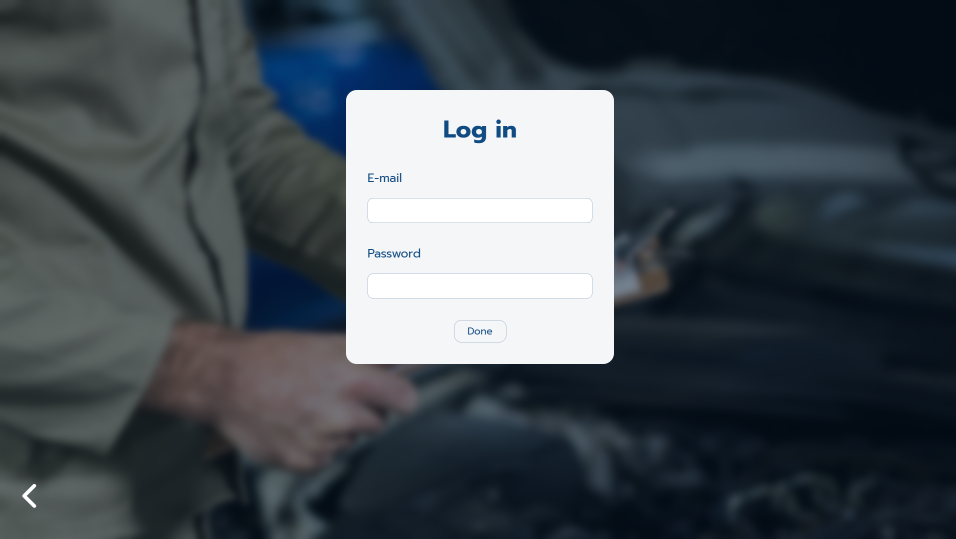
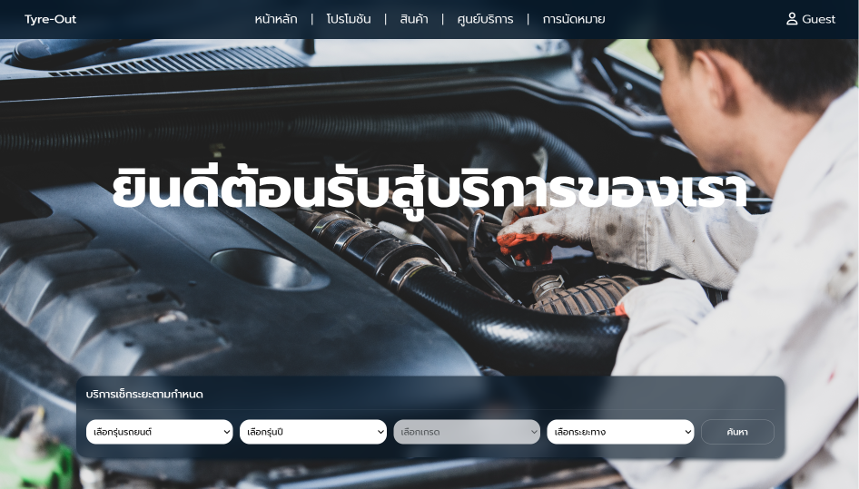
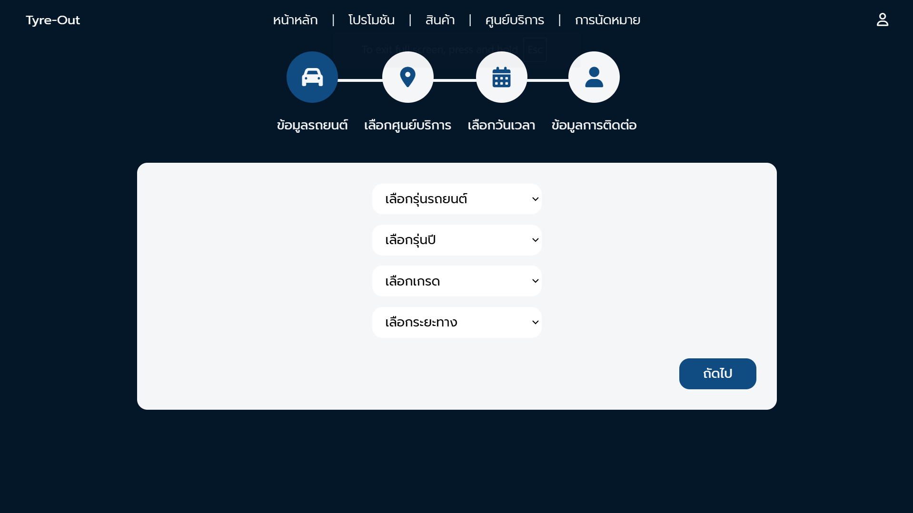
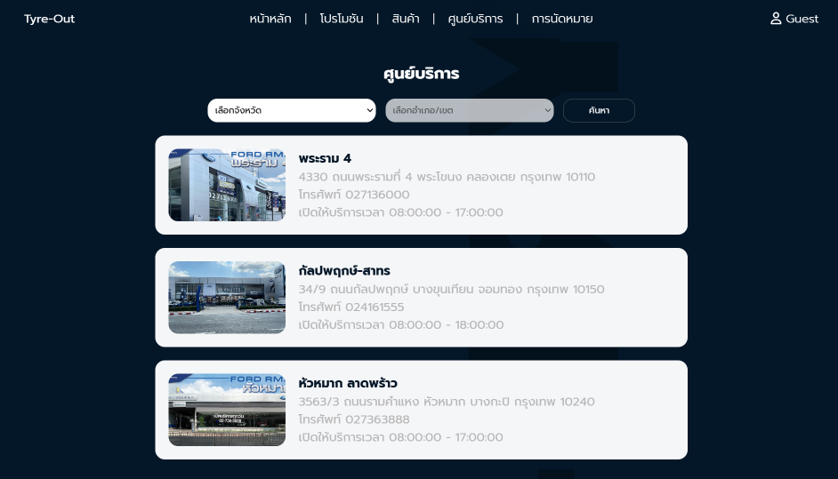

<!-- # Tyre-Out
06066302 Fundamental Web Programming  
School of Information Technology, KMITL  
Year 2/2024

--- -->

# What is Tyre-Out?

### Tyre-Out is a web application designed to be a car service center organizer by using Node.js with Express.js framework.

This project is a part of **Fundamental Web Programming** Course  
School of Information Technology, KMITL  
Year 2/2024

What our web app can do?
- Customer can reserve their mileage check by themselves on this web application and see overall goods and services price
- Admin can manage their customer such as open ticket, close ticker and others

<!--   -->
<!--   -->

# Some Preview of Our Project

<!--  -->
### Home Page

### Booking Page

### Service Center Page

<!--   -->
<!--   -->

# How to Use & Install
- [demo with run.bat](./demo.md)
- [runserver by using npm](./npm.md)

